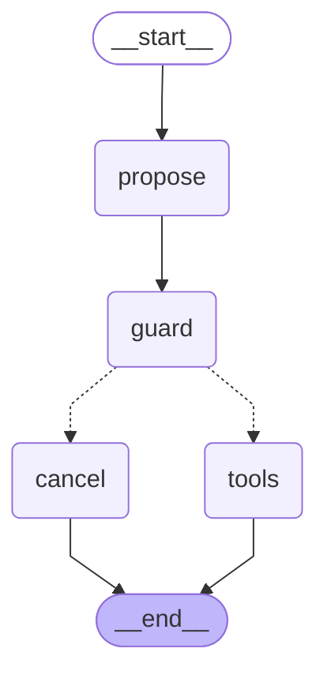

# Example 4 - a guard between the proposal and the tool

```mermaid
---
config:
  flowchart:
    curve: linear
---
graph TD;
	__start__([<p>__start__</p>]):::first
	propose(propose)
	guard(guard)
	tools(tools)
	cancel(cancel)
	__end__([<p>__end__</p>]):::last
	__start__ --> propose;
	guard -.-> cancel;
	guard -.-> tools;
	propose --> guard;
	cancel --> __end__;
	tools --> __end__;
	classDef default fill:#f2f0ff,line-height:1.2
	classDef first fill-opacity:0
	classDef last fill:#bfb6fc

```
